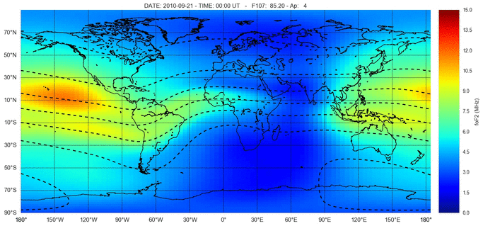
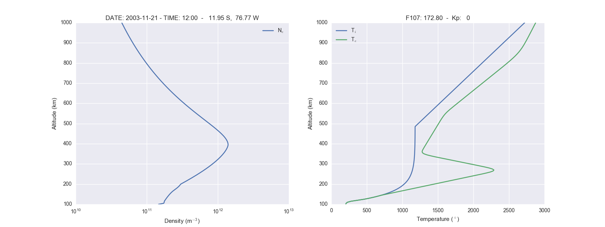
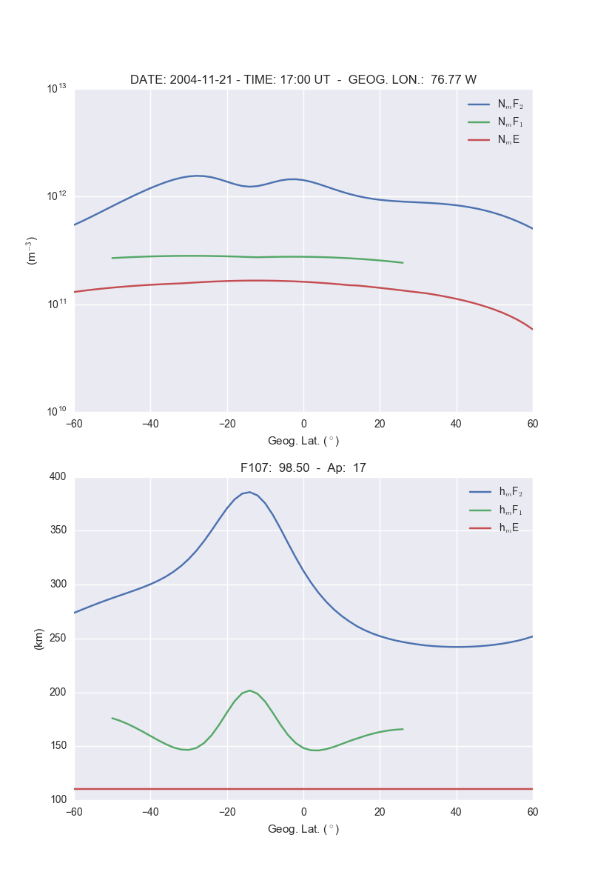
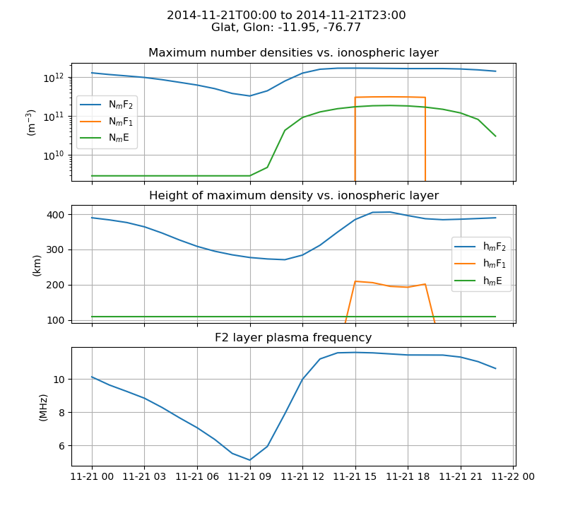
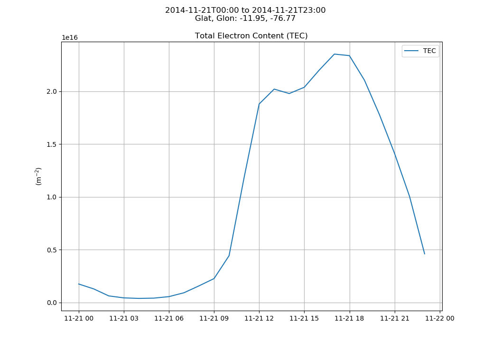
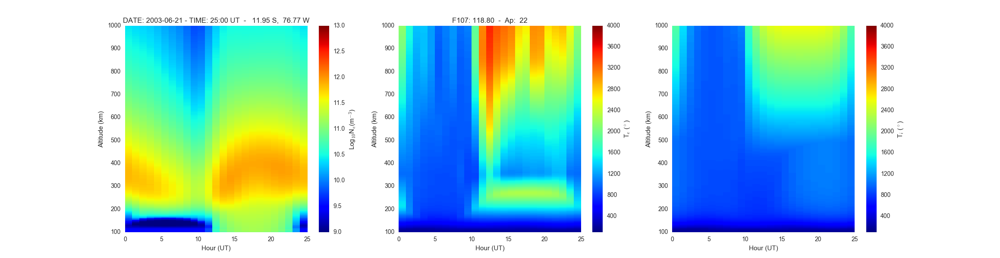
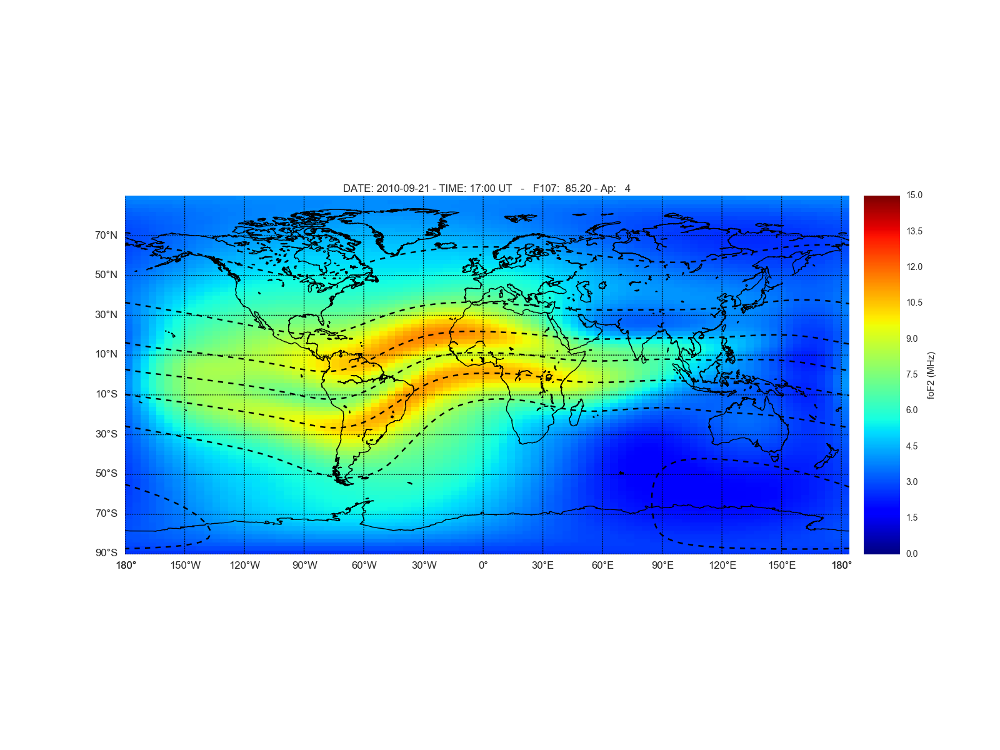
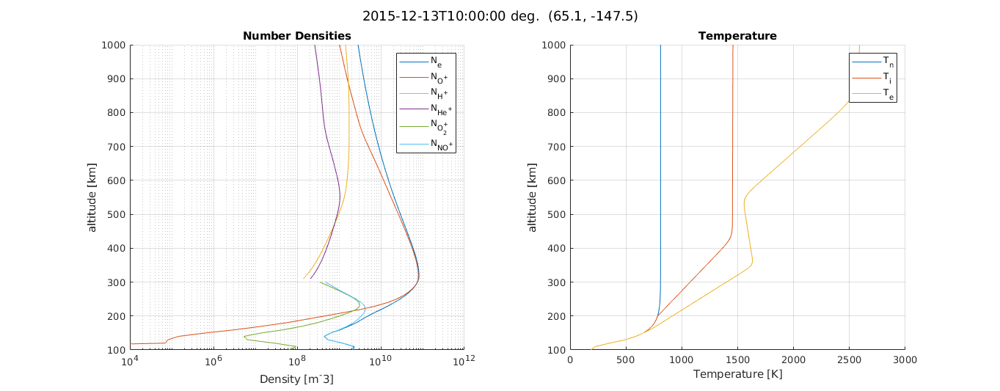

# IRI2016 ionosphere model from Python and Matlab

[](https://doi.org/10.5281/zenodo.240895)

[](https://www.mathworks.com/matlabcentral/fileexchange/81056-iri2016)
[](https://pypi.python.org/pypi/iri2016)
[](https://pepy.tech/project/iri2016)



Python and [Matlab](#matlab) interfaces to the International Reference Ionosphere (IRI) 2016 model.
A Fortran compiler is required to build the IRI2016 code.

## Install

Prerequisites

* Fortran compiler--any modern Fortran compiler will do. Here's how to get Gfortran:
  * Linux: `apt install gfortran`
  * Mac: `brew install gcc`
  * Windows: consider [MSYS2](https://www.scivision.dev/install-msys2-windows/)

and then install latest release:

```sh
pip install iri2016
```

if you want the latest development version:

```sh
git clone https://github.com/space-physics/iri2016

pip install -e iri2016
```

This Python wrapper of IRI2016 uses our build-on-run technique.
On the first run or `iri2016.IRI()` the Fortran code is built--we call this "build on run".

If you have errors about building on the first run, ensure that your Fortran compiler is specified in environment variable FC--this is what most build systems use to indicate the desired Fortran compiler (name or full path).

## Usage

* Altitude Profile: plot density and temperatures vs altitude

  ```sh
  python -m iri2016.altitude 2003-11-21T12 -11.95 -76.77
  ```

  
* Latitude profile: plot densities and height at the peak of F2, F2, and E regions vs geographic latitude

  ```sh
  python -m iri2016.latitude 2004-11-21T17 -76.77
  ```

  
* Time profile: plot densities and height at the peak of F2, F2, and E regions vs UTC

  ```sh
  python -m iri2016.time 2014-11-21 2014-11-22 1 -11.95 -76.77
  ```

  

  

  
* Latitude vs Longitude: plot of foF2 a function of geographic latitude and longitude
  

### setting JF flags

[irisub.for](./iri2016/src/irisub.for) has a few dozen logical flags stored in variable JF. To reconfigure those flags, edit [iri2016_driver.f90](./iri2016/src/iri2016_driver.f90) and recompile iri2016_driver.exe.

### Matlab

IRI2016 is readily accessible from Matlab.
From within Matlab verify everything is working by:

```matlab
TestAll
```

The [Examples](./Examples) directory has simple example use with plots.



## Data files

`iri2016/iri2016/data/index/{apf107,ig_rz}.dat` are
[regularly updated](http://irimodel.org/indices/).
Currently we don't auto-update those.

## Notes

* [2016 presentation](https://doi.org/10.5281/zenodo.1493021)
