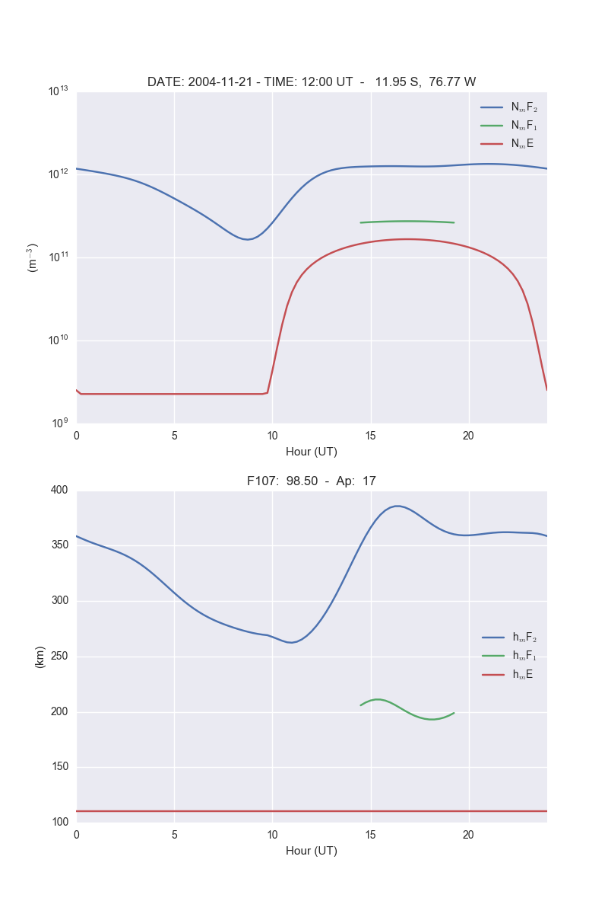

.. image:: https://travis-ci.org/scivision/pyIRI2016.svg?branch=master
    :target: https://travis-ci.org/scivision/pyIRI2016

.. image:: https://zenodo.org/badge/DOI/10.5281/zenodo.240895.svg
    :target: https://doi.org/10.5281/zenodo.240895

=========
pyIRI2016
=========

.. image:: figures/iri2DExample02.gif

A Python interface to the International Reference Ionosphere (IRI) 2016 model.

Install
=======
::

    pip install pyiri2016

or::

    python -m pip install -e .

This also installs `Time Utilities <https://github.com/rilma/TimeUtilities>`_.

Usage
=====

Height-profile
---------------

`plot density and temperatures vs height <AltitudeProfile.py>`_

.. image:: figures/iri1DExample01.png

Latitudinal profile
-------------------

`plot densities and height at the peak of F2, F2, and E regions vs geographic latitude <LatitudeProfile.py>`_

.. image:: figures/iri1DExample02.png

GMT profile
-----------
`plot densities and height at the peak of F2, F2, and E regions vs universal time <TimeProfile.py>`_

Height vs GMT
-------------
`plot Ne, Te, and Ti as a function of height and universal time: <scripts/iri2DExample01.py>`_

.. image:: figures/iri2DExample01.png

Latitude vs Longitude
---------------------
`plot of foF2 a function of geographic latitude and longitude <scripts/iri2DExample02.py>`_

.. image:: figures/iri2DExample02.png

Notes
=====
These commands are not normally needed unless you want to work with the Fortran code more directly.

Fortran compile
---------------
::

    cd bin
    cmake ../fortran

    make

    make test

f2py compile
------------
The function `DFRIDR()` inside `igrf.for` dynamically calls other functions.
This is something `f2py` can't access directly, so we tell `f2py` not to hook into function `DFRIDF()` with the end statement `skip: dfridr`::

    f2py -m iri2016 -c iriwebg.for irisub.for irifun.for iritec.for iridreg.for igrf.for  cira.for iriflip.for  skip: dfridr

f2py: IGRF only
---------------
::

    f2py -m igrf -c irifun.for igrf.for skip: dfridr

